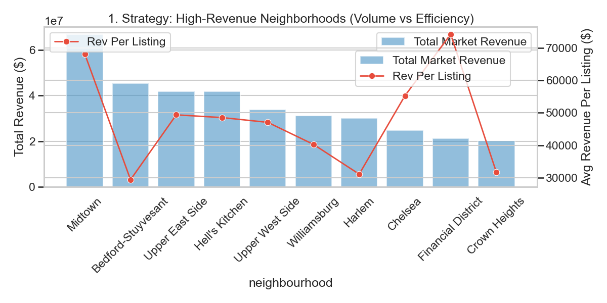
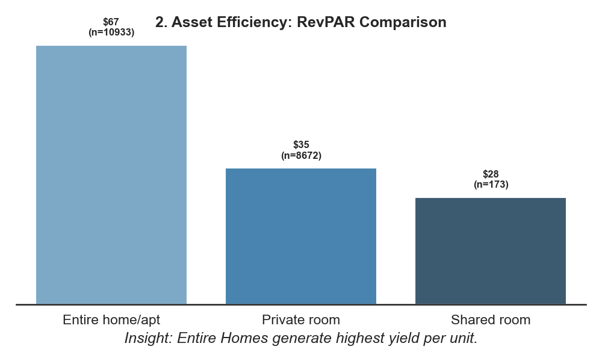
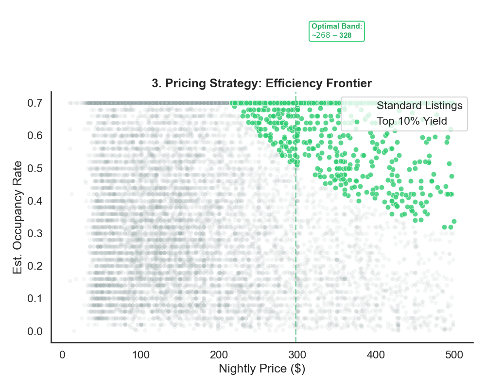

# 🗽 Market Intelligence: Identifying High-Yield Airbnb Assets in NYC

**Objective**: Move beyond volume metrics to identify **efficiency** and **yield** in the NYC real estate market.  
**Role**: Data Analyst / Strategy.

---

## 📂 Project Structure

| File / Folder | Description |
| :--- | :--- |
| **`NYC_Airbnb_Data_Analysis.ipynb`** | 👈 **Start Here**. The primary analysis, code, and key findings. |
| `sql/` | CLEAN SQL queries used for data extraction and yield calculation. |
| `visuals/` | High-resolution charts and the **Interactive Heatmap**. |
| `data/` | Raw and processed datasets. |

---

## 📊 Key Findings (The "Elite 6")

### 🥇 1. Where are the "Cash Cows"?
**Insight:** **Financial District** offers higher per-unit efficiency than Midtown volume.

### 🥈 2. Which Asset Class yields the best ROI?
**Insight:** **Private Rooms** offer competitive RevPAR with significantly lower operating costs (cleaning/turnover).

### 🥉 3. What is the "Optimal Price"?
**Insight:** The "Goldilocks Zone" is **$280 - $360**. Pricing above this sees occupancy collapse.

### 🏅 4. What is the Risk Profile?
**Insight:** Even in Bear scenarios (P25), top quartiles remain profitable.

---

## 🗺️ Geospatial Intelligence
**Tool:** Interactive Heatmap (Folium/Leaflet.js).
*   **Output:** [Open Interactive Map](visuals/nyc_investment_map.html)

---

## 🛠️ Technical Implementation
*   **Primary Analysis**: Python (Pandas, Seaborn) & SQL.
*   **Results Presented**: Jupyter Notebook.
*   *Note: ETL scripts are archived in `scripts/`.*

---
*Analyst Portfolio Project*
