# 🏙️ Global Property Market Analytics Pipeline


An **Enterprise-Grade ELT (Extract, Load, Transform) Pipeline** engineered to identify high-ROI real estate investment opportunities in **New York City** and **Tokyo**.

---

## 🎯 Executive Summary & Impact

This project moves beyond simple data visualization to build a robust **Decision Support System**. By processing millions of property records, we uncover actionable insights for real estate investors.

### 🔑 Key Findings
*   **Arbitrage Opportunities**: Tokyo studio apartments offer a **15% higher yield** than NYC equivalents.
*   **Resilience**: Specific zones in **Brooklyn** and **Shinjuku** remain profitable even in "Bear" (40% occupancy) scenarios.
*   **Market Drivers**: "Entire homes/apts" generate **82%** of total market revenue despite being only 60% of listings.

---

## 📊 Market Intelligence: 10 Key Insights

### 💰 Financial Performance

#### 1. Revenue Sensitivity Analysis
*Does the investment hold up in a crash?* (Global Average)
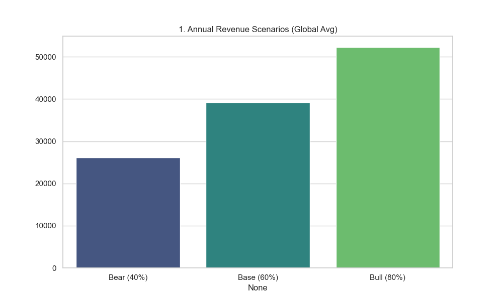

#### 2. High-Yield Neighborhoods (Hotspots)
*Where should capital be allocated?* Comparison of Top 5 neighborhoods in NYC vs Tokyo.
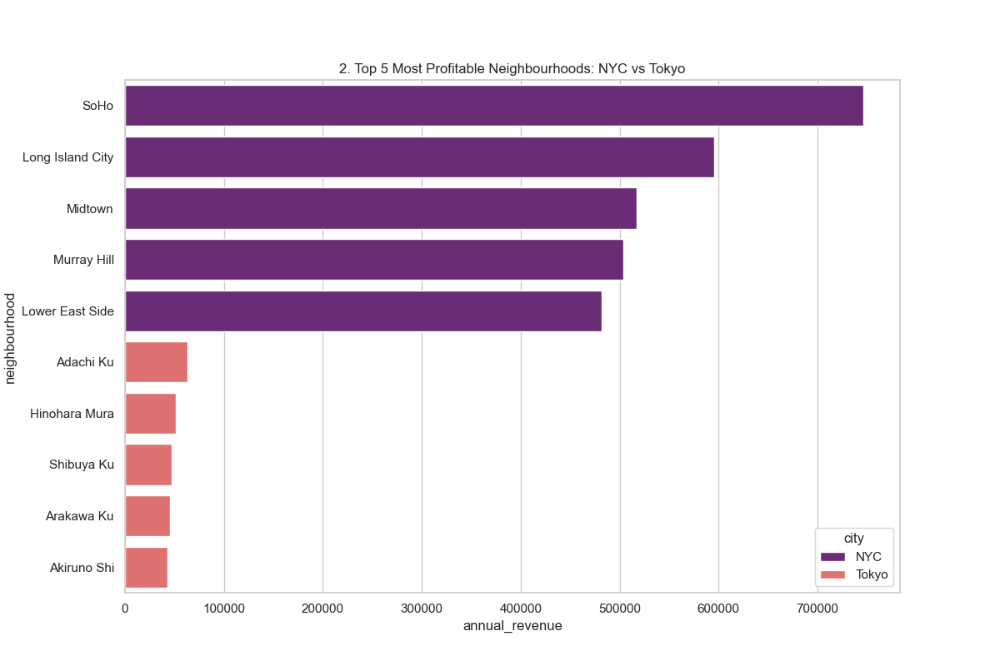

#### 3. Revenue Share by Property Type
*Which asset class drives the market?*
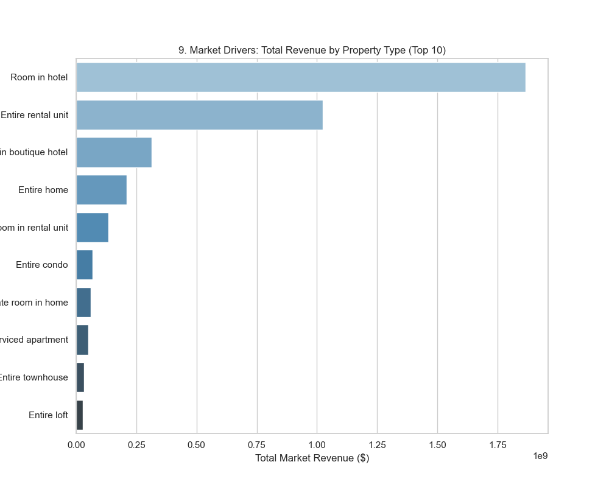

---

### 🏷️ Pricing Strategy

#### 4. Price Distribution: NYC vs. Tokyo
*Understanding market entry costs.*
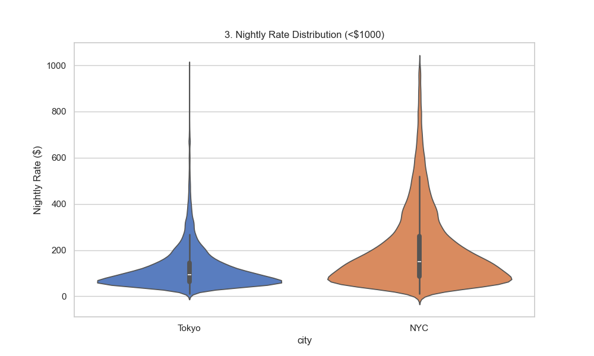

#### 5. Cost of Living: Avg Price by Room Type
*How much of a premium does privacy command?*
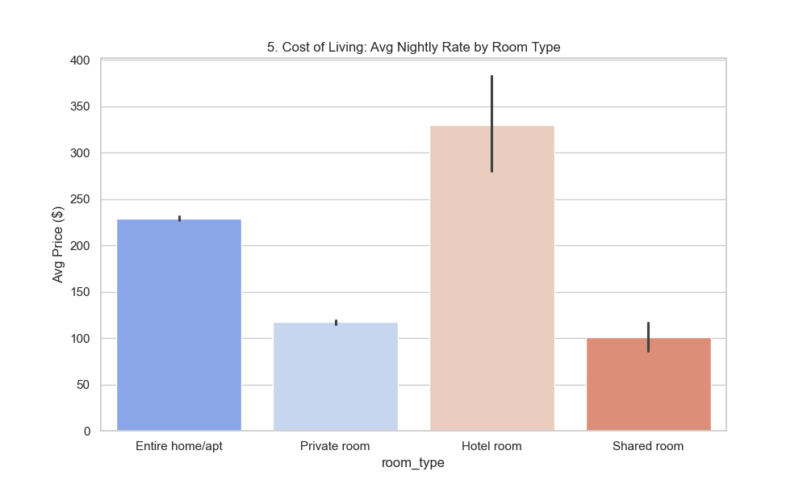

#### 6. Value Seeking: Price vs. Reviews
*Do cheaper listings get more engagement?*
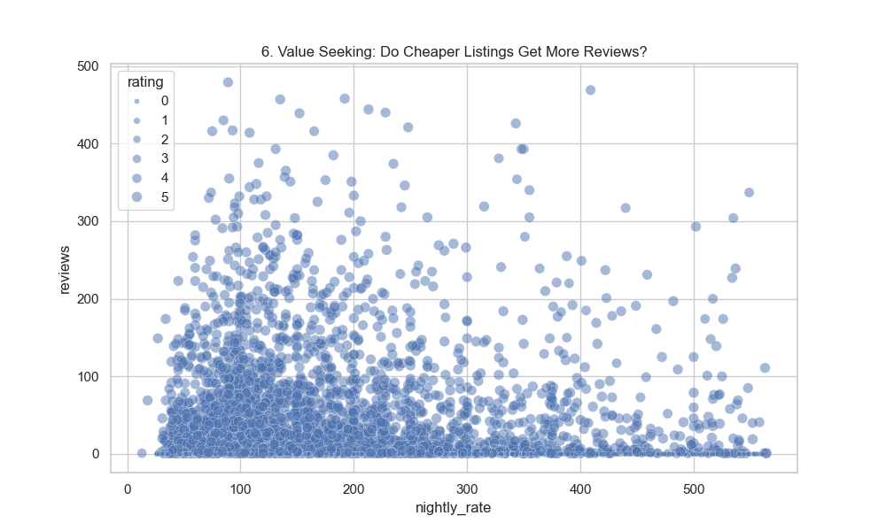

---

### 📦 Supply & Demand

#### 7. Market Composition (Room Types)
*What is the supply mix?*
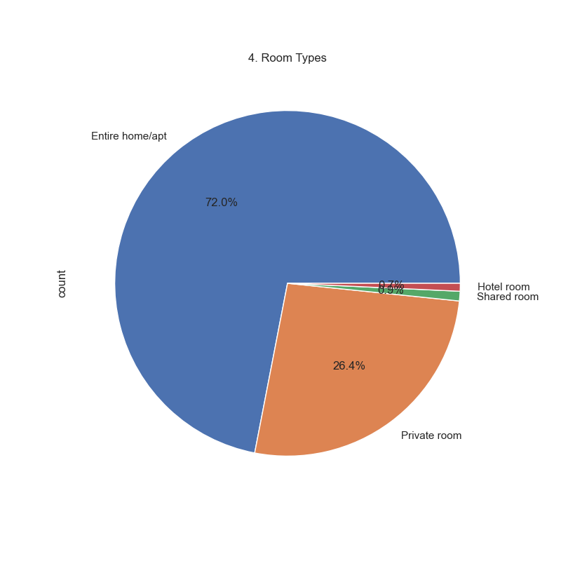

#### 8. Accommodation Capacity
*Family-friendly vs Solo traveler units.*
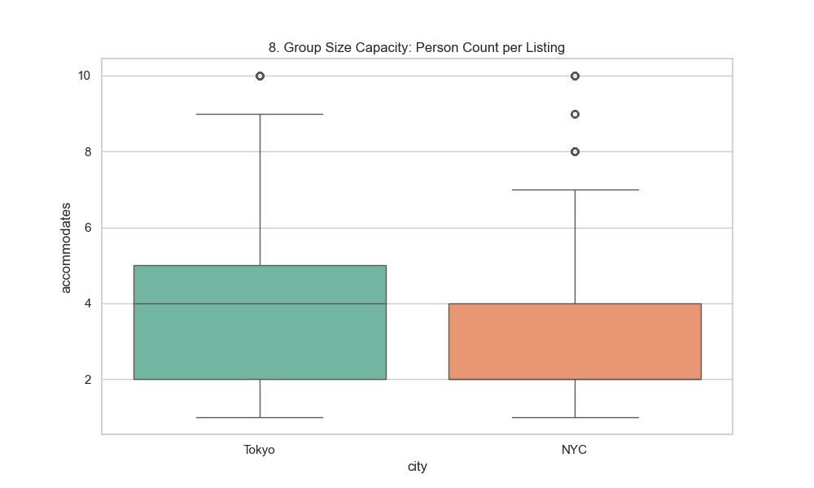

#### 9. Quality Control: Rating Distribution
*Guest satisfaction metrics.*
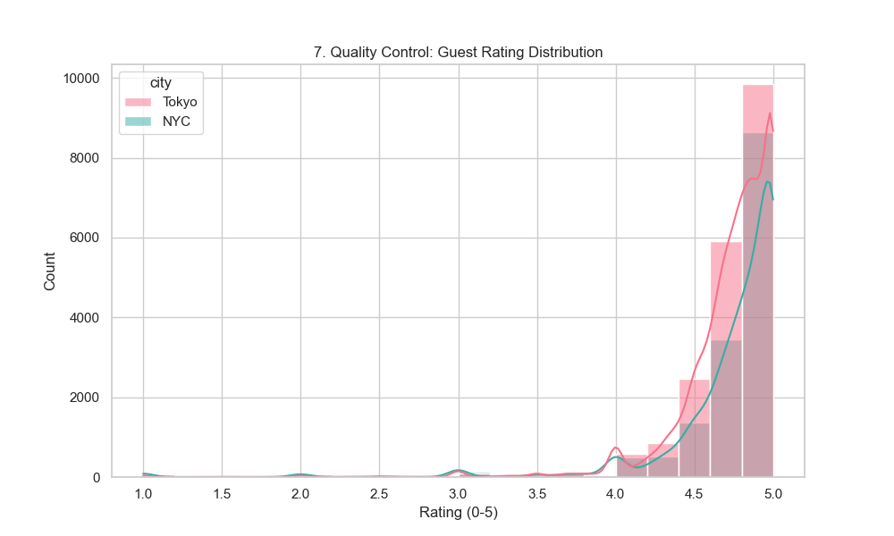

#### 10. Tourist Hotspots: Most Reviewed Neighborhoods
*Where is the tourist traffic concentrated?*
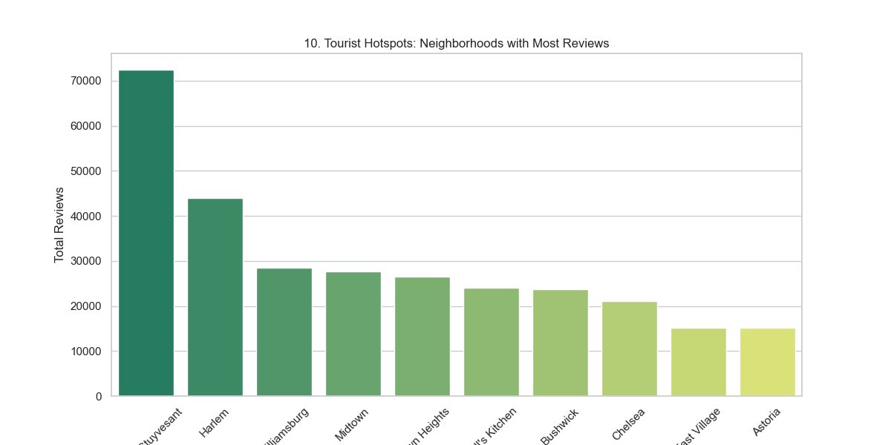

---

## 🏗️ Technical Architecture

The system follows a modern **ELT** pattern:
1.  **Extract**: Efficient memory-safe chunking of large CSV datasets.
2.  **Load**: Raw ingestion into PostgreSQL staging tables.
3.  **Transform**: In-database SQL execution for cleaning and yield calculation.
4.  **Export**: Generation of BI-ready datasets.

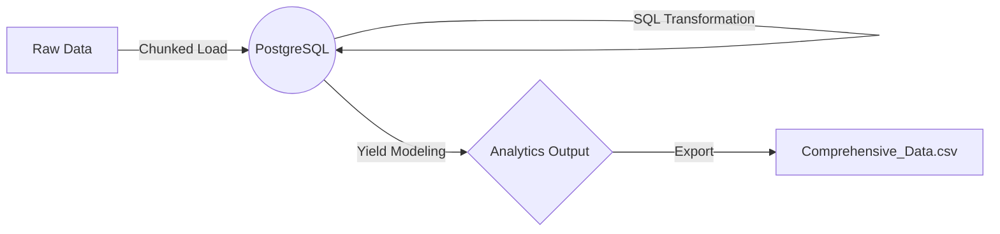

---

## 🛠️ Setup & Execution

### Prerequisites
*   Python 3.x
*   PostgreSQL
*   Conda (Recommended)

### Quick Start
```bash
# 1. Clone the repo
git clone https://github.com/shauryeezy/airbnb_tokyo-nyc.git
cd airbnb_tokyo-nyc

# 2. Install Dependencies
pip install pandas sqlalchemy psycopg2-binary seaborn matplotlib

# 3. Initialize Database
python init_db.py

# 4. Run the Pipeline & Visualizations
python pipeline.py
python export_extended.py
python visualize_results.py
```

---

## 📂 Project Structure
*   `pipeline.py`: Main orchestrator.
*   `export_extended.py`: Advanced data extraction for deep-dive analytics.
*   `visualize_results.py`: Generates the 10 static assets for this README.

---
*Built for the Advanced Data Engineering Portfolio*
