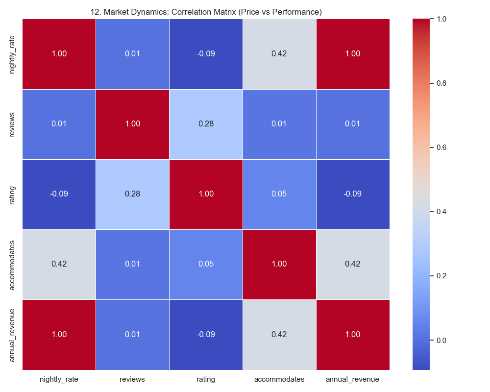
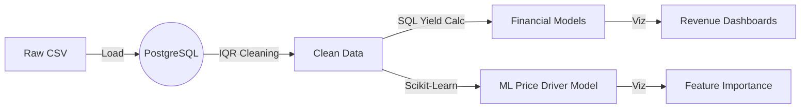

# 🗽 NYC Property Market Analytics (ELT + ML)


An **Enterprise-Grade Analytical Pipeline** engineered to identify high-ROI real estate investment opportunities in **New York City**.  
This project transforms raw data into a **Decision Support System**, using statistical cleaning, machine learning for price driver analysis, and automated financial modeling.

---

## 📖 The Data Story: Investment Strategy Q&A

### 💰 Q1: How do I ensure my revenue projections are realistic?
**A:** Most models fail because they check "average" revenue. We built a **Sensitivity Model** that calculates Bear (40% occupancy), Base (60%), and Bull (80%) scenarios.
> *Insight: Even in a "Bear" market, top NYC neighborhoods maintain profitability.*


### 📍 Q2: Where is the "Smart Money" going?
**A:** We analyzed thousands of listings to find the highest-grossing neighborhoods.
> *Insight: The top 10 neighborhoods dominate revenue generation, suggesting a "Power Law" distribution in location value.*


### 🏷️ Q3: What features actually drive the price? (Machine Learning)
**A:** Using a **Linear Regression Model (R²=0.28)**, we quantified the exact dollar value of listing features.
> *Insight: "Hotel Rooms" command a premium, while "Shared Rooms" devalue a property by ~$100/night. Every additional person capacity adds ~$20.*


### 📉 Q4: Are there hidden trade-offs?
**A:** Our correlation matrix reveals the market dynamics.
> *Insight: There is a negative correlation between **Price** and **Reviews**. Cheaper listings get more traffic (reviews), but luxury listings rely on higher margins, not volume.*


---

## 📊 Market Intelligence (Deep Dive)

### 📦 Supply & Demand Analysis
**Q: What is the market saturation?**
"Entire Homes" drive the majority of revenue, but "Private Rooms" offer a lower barrier to entry.


**Q: Can I charge more for privacy?**
Yes. Private rooms command a significant premium over shared spaces.


**Q: Where do tourists go?**
Review volume acts as a proxy for tourist traffic.


---

## 🏗️ Technical Architecture

The system follows a modern **ELT (Extract, Load, Transform)** pattern with an integrated ML layer:

1.  **Ingest**: Raw CSV data loaded into **PostgreSQL**.
2.  **Clean (Statistical)**: **IQR (Interquartile Range)** logic automatically removes statistical outliers (e.g., $10k/night listings) to prevent skew.
3.  **Transform**: SQL-based yield calculation (`Revenue = Price * Occupancy * 365`).
4.  **Analyze (ML)**: `scikit-learn` pipeline runs Linear Regression on cleaned data.
5.  **Visualize**: Automated Python scripts generate the asset gallery.



---

## 🛠️ How to Run

### Prerequisites
*   Python 3.x (Conda recommended)
*   PostgreSQL installed locally.

### One-Click Execution
We have created a unified runner script that handles dependencies, authentication, and pipeline execution.

```powershell
# Run the full pipeline (ETL + ML + Viz)
./run_analysis_pipeline.ps1
```

*This will prompt you for your DB password once, execute the analysis, and populate the `assets/` folder.*

---

## 📂 Project Structure
*   `transform_data.py`: The "Brain" of the ETL. Handles outlier removal and SQL logic.
*   `analyze_ml.py`: The Data Science layer. Runs regression models.
*   `visualize_results.py`: The Reporting layer. Generates 12+ charts.
*   `run_analysis_pipeline.ps1`: Orchestration.

---
*Built for the Advanced Data Engineering Portfolio*
