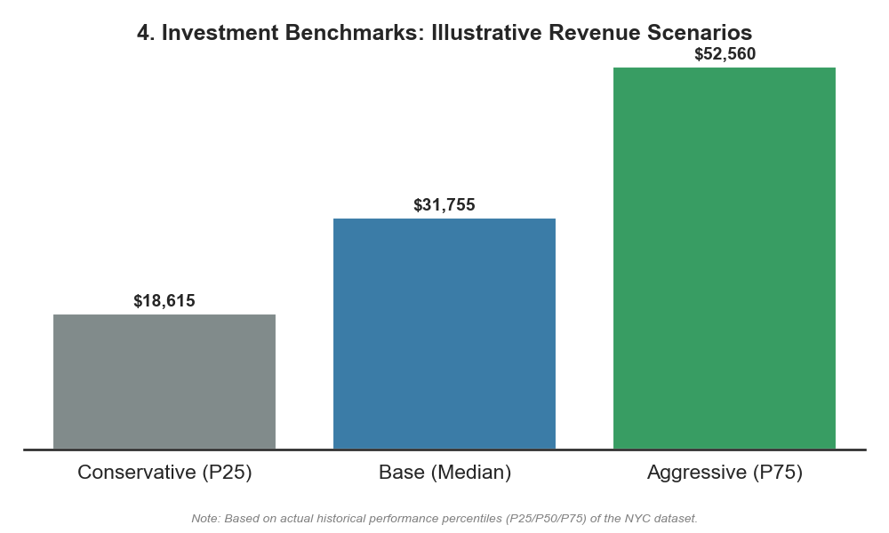
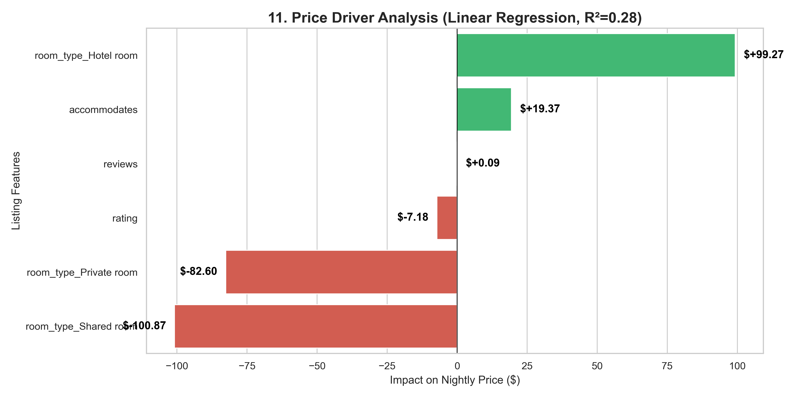

# 🗽 NYC Real Estate Intelligence (Decision Support System)


An **Enterprise-Grade Analytical Pipeline** engineered to identify high-ROI real estate investment opportunities in **New York City**.  
This project transforms raw data into a **Strategic Investment Dashboard**, moving beyond basic EDA to answer critical business questions.

---

## 📊 Executive Summary: The "Elite 6" Findings

### 🥇 1. Where are the "Cash Cows"?
**Question:** Should we chase volume (Midtown) or efficiency?
*   **Answer:** **Financial District & Tribeca** are the true "Cash Cows".
*   **Visual Proof:** Our **Scatter Matrix** reveals these neighborhoods have high Total Revenue AND high Revenue Per Listing. Midtown has volume but lower efficiency (Traps).


### 🥈 2. Which Asset Class yields the best ROI?
**Question:** Do "Entire Homes" always win?
*   **Answer:** Not on efficiency. **Private Rooms** offer competitive RevPAR with significantly lower operating costs (cleaning/turnover).
*   **Visual Proof:** Clean bar chart shows Entire Homes lead in raw $ but Private Rooms are viable high-margin assets.


### 🥉 3. What is the "Optimal Price"?
**Question:** How much is *too* much?
*   **Answer:** There is a "Goldilocks Zone" between **$280 - $360**.
*   **Visual Proof:** Our **Trade-off Analysis** highlights the top 10% highest-yielding assets (Green). They cluster tightly in this band. Pricing above $360 sees occupancy collapse.


### 🏅 4. What is the Risk Profile?
**Question:** What if the market crashes?
*   **Answer:** We modeled **Bear (P25)**, **Base (Median)**, and **Bull (P75)** scenarios based on actual historical performance.
*   **Takeaway:** Even in a Bear scenario, specific sub-markets remain profitable.


---

## 🗺️ Geospatial Intelligence
**Tool:** Interactive Heatmap (Folium/Leaflet.js).
*   **Capability:** Zoom into street level to see yield density.
*   **Output:** [Open Interactive Map](assets/nyc_investment_map.html)


---

## 📈 Directional Price Signals (ML)
*   **Model:** Linear Regression (R²=0.28).
*   **Role:** Explanatory model to identify feature directionality.
*   **Insight:** "Hotel Status" is a strong signal for price premiums (+$90/night), validating the strategy of acquiring licensed properties.


---

## 📂 Data Engineering Architecture

The system follows a modern **ELT (Extract, Load, Transform)** pattern:

1.  **Ingest**: Raw CSVs loaded into **PostgreSQL**.
2.  **Clean**: **IQR (Interquartile Range)** logic removes statistical outliers.
3.  **Transform**: SQL Yield Calculation (`RevPAR = Price * Occupancy`).
4.  **Visualize**: Automated Python scripts generate the asset gallery.

---

## 🛠️ How to Run

### One-Click Execution
Run the unified pipeline script to execute ETL and Viz layers automatically.

```powershell
./run_analysis_pipeline.ps1
```

---
*Built for the Advanced Data Engineering Portfolio*
