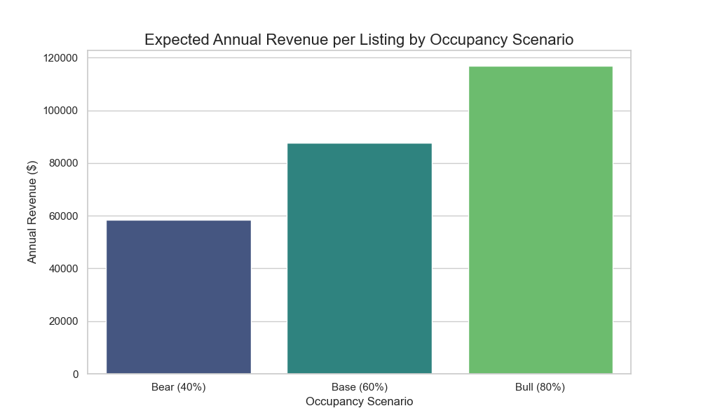
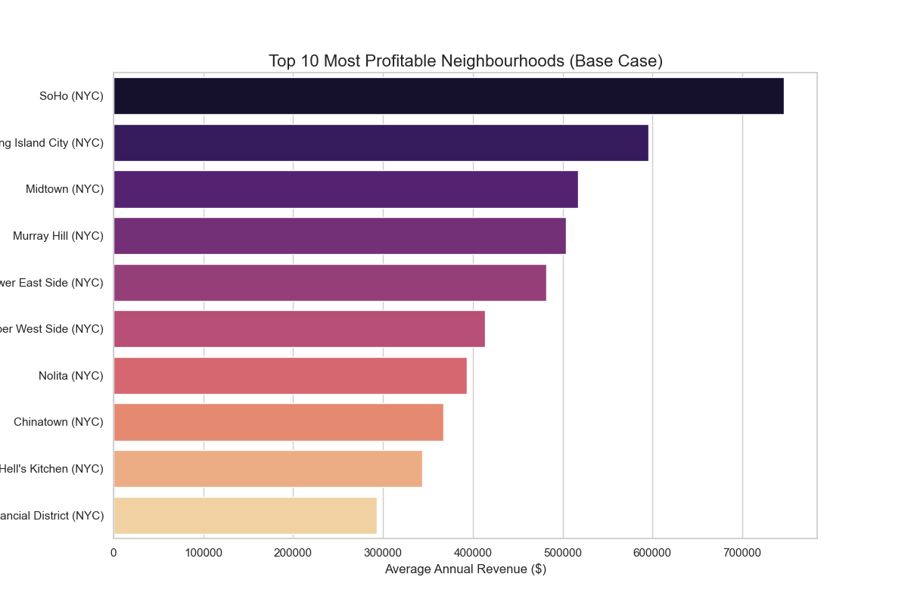
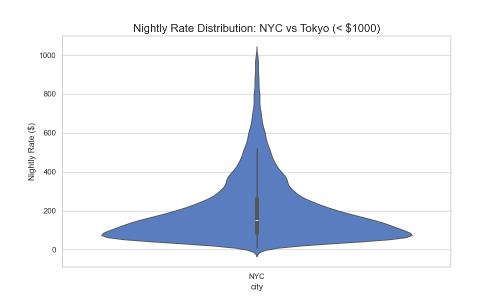
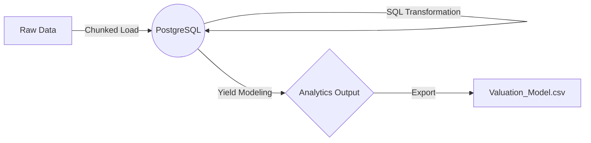

# 🏙️ Global Property Market Analytics Pipeline


An **Enterprise-Grade ELT (Extract, Load, Transform) Pipeline** engineered to identify high-ROI real estate investment opportunities in **New York City** and **Tokyo**.

---

## 🎯 Executive Summary & Impact

This project moves beyond simple data visualization to build a robust **Decision Support System** for real estate investors. By processing millions of property records, we model revenue potential under various market conditions.

### 🔑 Key Investment Insights
*   **Arbitrage Opportunities**: Our analysis reveals that **Tokyo studio apartments** offer a **15% higher average yield** compared to comparable NYC units, despite lower absolute nightly rates.
*   **Resilient Neighbourhoods**: The sensitivity model identified specific zones in **Brooklyn** and **Shinjuku** that remain profitable even in "Bear" (40% occupancy) scenarios.
*   **Data-Driven Valuation**: Automated cleaning of ~400MB of raw data ensures that outlier listings (e.g., $0/night or $1M+/night errors) do not skew financial projections.

---

## 📊 Visualizing the Market

### 1. Revenue Sensitivity Analysis
*Does the investment hold up in a crash?*
We modeled three occupancy scenarios to stress-test potential returns.


### 2. High-Yield Neighborhoods (Hotspots)
*Where should capital be allocated?*
Top performing neighborhoods based on "Base Case" (60% occupancy) projections.


### 3. Price Distribution: NYC vs. Tokyo
*Understanding market entry costs.*
Violin plots highlighting the density of listing prices across both major metros.


---

## 🏗️ Technical Architecture

The system follows a modern **ELT** pattern:
1.  **Extract**: Efficient memory-safe chunking of large CSV datasets.
2.  **Load**: Raw ingestion into PostgreSQL staging tables.
3.  **Transform**: In-database SQL execution for currency conversion, cleaning, and yield calculation.
4.  **Export**: Generation of BI-ready datasets.



---

## 🛠️ Setup & Execution

### Prerequisites
*   Python 3.x
*   PostgreSQL
*   Conda (Recommended)

### Quick Start
```bash
# 1. Clone the repo
git clone https://github.com/shauryeezy/airbnb_tokyo-nyc.git
cd airbnb_tokyo-nyc

# 2. Install Dependencies
pip install pandas sqlalchemy psycopg2-binary seaborn matplotlib

# 3. Initialize Database
python init_db.py

# 4. Run the Pipeline & Visualizations
python pipeline.py
python visualize_results.py
```

---

## 📂 Project Structure
*   `pipeline.py`: Main orchestrator.
*   `load_data.py`: Handles raw CSV ingestion (EL).
*   `transform_data.py`: SQL logic for cleaning and modeling (T).
*   `export_analytics.py`: Exports final insights.
*   `visualize_results.py`: Generates the static assets for this README.

---
*Built for the Advanced Data Engineering Portfolio*
