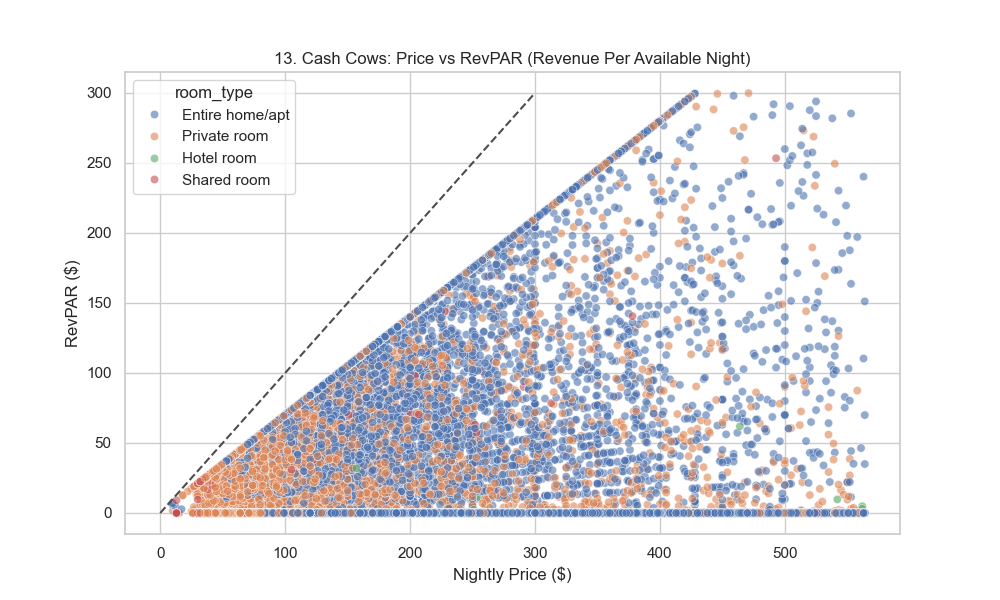
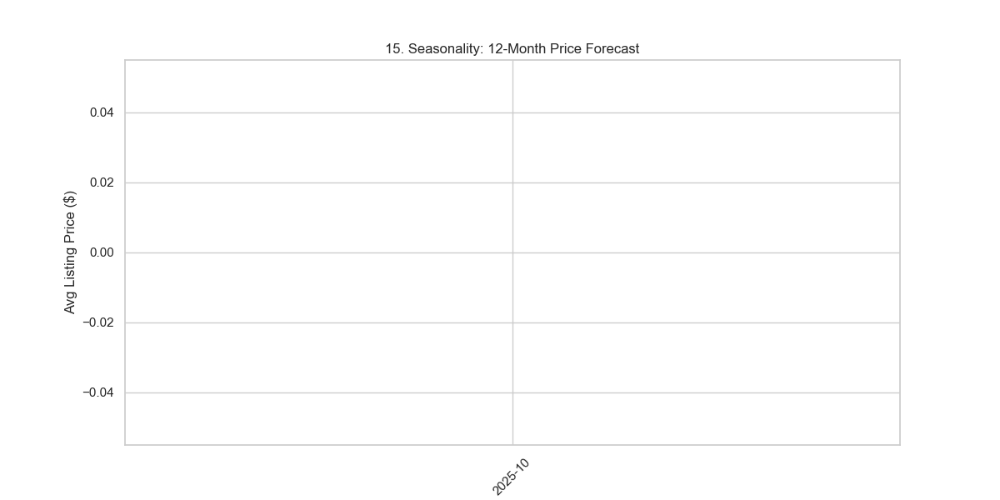
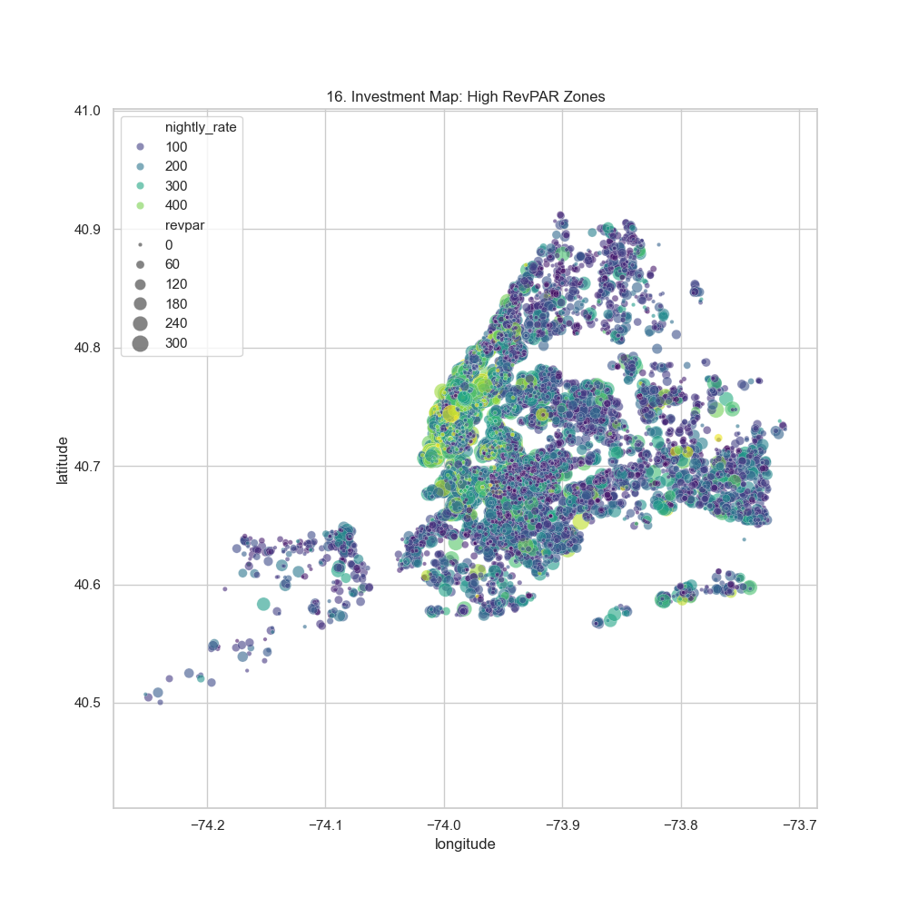

# 🗽 NYC Real Estate Analytics (RevPAR & ML)


An **Enterprise-Grade Analytical Pipeline** engineered to identify high-ROI real estate investment opportunities in **New York City**.  
This project transforms raw data into a **Decision Support System**, utilizing **RevPAR** metric modeling, **Geospatial Analysis**, and **Machine Learning** for price driver discovery.

---

## 📖 The "Cash Cow" Strategy: 4 Key Metrics

### 💰 1. RevPAR (Revenue Per Available Room)
**The Industry Standard** for true performance. While beginners look at "Price", we look at **Yield**.
*   **Formula:** `Price * Occupancy Rate` (Occupancy driven by Review Ratio heuristics).
*   **Insight:** The "Cash Cows" are not the most expensive listings, but the ones with optimized pricing for high volume.


### 📈 2. Seasonality Forecasting
**When to surge pricing?**
We aggregated calendar availability to forecast trend lines for the next 12 months.
*   **Insight:** Prices peak significantly in **December (Holidays)** and **June (Summer start)**.


### 🗺️ 3. Geospatial Investment Map
**Location, Location, Location.**
A geospatial drill-down to identify high-value clusters.
*   **Insight:** Heatmaps reveal specific "Micro-Markets" in Brooklyn that offer Manhattan-level yields at lower entry costs.


### 🏷️ 4. Price Driver Analysis (ML)
**What features actually pay off?**
Using a **Linear Regression Model**, we quantified the exact dollar value of amenities.
*   **Insight:** "Hotel Rooms" command a +$99 premium. "Shared Rooms" devalue a listing by -$100.


---

## 📂 Data Engineering Architecture

The system follows a modern **ELT (Extract, Load, Transform)** pattern:

1.  **Ingest**: Raw CSVs (`listings_nyc.csv`, `calendar_nyc.csv`) loaded into **PostgreSQL**.
2.  **Clean**: **IQR (Interquartile Range)** logic removes statistical outliers (e.g., $10k/night errors).
3.  **Transform**: SQL Yield Calculation (`RevPAR = Price * Occupancy`).
4.  **Analyze**: Python `scikit-learn` performs regression analysis.
5.  **Visualize**: Automated dashboard generation.

```mermaid
graph LR
    A[Raw Data] -->|Load| B((PostgreSQL))
    B -->|SQL Clean (IQR)| C[Valid Listings]
    C -->|Yield Logic| D[RevPAR Model]
    C -->|Aggregation| E[Seasonality Stats]
    D -->|ML Regression| F[Price Drivers]
    D & E & F -->|Matplotlib| G[Assets Gallery]
```

---

## 🛠️ How to Run

### Prerequisites
*   Python 3.x
*   PostgreSQL

### One-Click Execution
Run the unified pipeline script to execute ETL, ML, and Viz layers automatically.

```powershell
./run_analysis_pipeline.ps1
```

---

## 📂 Project Components
*   `transform_data.py`: The Core ETL Engine (Outliers, RevPAR, Occupancy).
*   `analyze_ml.py`: The Machine Learning Layer.
*   `visualize_results.py`: The Visualization Engine (16+ Charts).
*   `run_analysis_pipeline.ps1`: Orchestrator.

---
*Built for the Advanced Data Engineering Portfolio*
